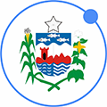
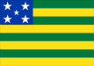
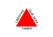

# Guia do Desenvolvedor Ionic
Um ótimo guia para aprender mais sobre Ionic e estar por
dentro das novidades.

Este guia é baseado no repositório [Ionic Adventures](http://github.com/juarezpaf/ionic-adventures) e tem como objetivo ser a fonte principal de informações relacionadas a conteúdo em Português para quem desenvolve utilizando o Ionic SDK e será mantido pela comunidade [Ionic Brazil](http://github.com/ionicbrazil).

## Tópicos

  1. [O que é o Ionic SDK?](#o-que-é-o-ionic-sdk)
  2. [Apresentações](#city_sunset-apresentações)
  3. [Artigos](#newspaper-artigos)
  4. [Vídeos](#video_camera-vídeos)
  5. [Livros](#books-livros)
  6. [Eventos, Cursos e Workshops](#eventos-cursos-e-workshops)
  7. [Ferramentas](#ferramentas)
  8. [Outros Serviços](#outros-serviços)
  9. [Open Source](#open-source)
  10. [Showcases no Brasil](#showcases-no-brasil)
  11. [Comunidade Ionic Brazil](#comunidade-ionic-brazil)
  12. [Meetups](#meetups)

## O que é o Ionic SDK?
O Ionic SDK é um projeto Open Source gratuito usado no desenvolvimento de aplicativos híbridos para as plataformas Android 4.4+ e iOS 6+ com suporte parcial ao Windows Phone. Ionic SDK utiliza os recursos do HTML, CSS, Javascript e AngularJS, que possui o objetivo de deixar a experiência do usuário fluída e diminuir o tempo de desenvolvimento, e tem ganho notoriedade também pelo conjunto de ferramentas disponibilizados como Ionic View, Ionic Push, entre outras.

O Ionic também possui integração com o [Cordova](https://cordova.apache.org/) e o [ngCordova](http://ngcordova.com/) tornando capaz a utilização de recursos nativos dos dispositivos.

- :green_heart:: Básico
- :large_orange_diamond:: Intermediário
- :red_circle:: Avançado

## :city_sunset: Apresentações

Url | Autor | Nível | Idioma
--- | --- | --- | ---
[Aplicativos Híbridos com Ionic. Você também pode começar a desenvolver agora!](http://www.tiagoporto.com/aplicativos-hibridos-com-ionic-voce-tambem-pode-comecar-a-desenvolver-agora) | @tiagoporto | :green_heart:| Português
[Ionic Rocks!](https://speakerdeck.com/vitormalencar/ionic-rocks) | @vitormalencar | :green_heart:| Português
[Construindo Aplicativos Híbridos com Ionic Framework](http://alvarowolfx.github.io/ionic-present/#/) | @alvinhuuu | :green_heart:| Português
[Ionic Framework e sua Linda Performance](http://pt.slideshare.net/thompsonemerson/ionic-frameworks-e-sua-linda-performance-mobile-conf-2015) | @thompsonweb | :green_heart:| Português
[Usando PushWoosh com Ionic Framework](http://pt.slideshare.net/thompsonemerson/usando-pushwoosh-com-ionic-framework) | @thompsonweb | :green_heart:| Português
[Super Apps Híbridas com Ionic](http://mabrasil.github.io/talks/2015/cocoaheads/) | @mabrasil | :green_heart:| Português
[Melhorando seu workflow Ionic](http://mabrasil.github.io/talks/2015/ionic-meetup) | @mabrasil | :green_heart:| Português
[Mini Curso Ionic](http://www.slideshare.net/loianeg/mini-curso-ionic-framework) | @loiane | :green_heart:| Português
[Offline Apps com Ionic e PouchDB](http://www.slideshare.net/alvarowolfx/offline-apps-using-ionic-framework-and-pouchdb) | @alvinhuuu | :green_heart:| Inglês
[Entendendo Ionic Framework](http://arthuralves.github.io/entendendoionic) | @arthuralv3s | :green_heart:| Português

## :newspaper: Artigos
- :green_heart:: Básico
- :large_orange_diamond:: Intermediário
- :red_circle:: Avançado
- :a:: Angular
- :vibration_mode:: Ionic

Url | Assunto | Autor | Nível
--- | --- | --- | ---
[AngularJS Promises - O guia definitivo](http://nomadev.com.br/angularjs-promises-promessas-o-guia-definitivo/) |:a:| Nomadev | :large_orange_diamond:
:zap: [O que eu preciso saber para começar com Ionic Framework](http://tutsmais.com.br/blog/ionicframework/o-que-eu-preciso-saber-para-comecar-com-ionic-framework) |:vibration_mode:| @felquis | :green_heart:
[Introdução ao Ionic Framework](http://tableless.com.br/introducao-ao-ionic-framework/) |:vibration_mode:| @grillorafael | :green_heart:
[Aplicativos mobile com o AngularJS e Ionic](http://frontinbrazil.com.br/aplicativos-mobile-com-o-angularjs-e-ionic/) |:vibration_mode:| @JLCarv | :green_heart:
[Criando aplicativo com Ionic Framework](http://nicholasess.com.br/desenvolvimento/criando-aplicativo-com-ionic-framework-serie/) |:vibration_mode:| @nicholasess | :green_heart:
[Apps Híbridas com Cordova e Ionic #1](http://luisvasconcellos.com/2015/04/06/apps-hibridas-com-cordova-e-ionic.html) |:vibration_mode:| @vasconcelloslf | :green_heart:
[O erro dos Apps criados com Ionic](https://medium.com/@LithiumBr/o-erro-dos-apps-criados-com-ionic-6797c1216d15?source=tw-992152d591ea-1436294034569) | :vibration_mode:| @raphaelpor | :large_orange_diamond:
[4 Dicas para trabalhar com o Ionic Framework](http://frontinbrazil.com.br/4-dicas-ionic-framework/) |:vibration_mode:| @JLCarv | :large_orange_diamond:
[Dicas para trabalhar com o Ionic – PouchDB](http://frontinbrazil.com.br/pouchdb/) | :vibration_mode: | @JLCarv | :large_orange_diamond:
[Dicas para trabalhar com o Ionic – Persistence.js Migrations](http://frontinbrazil.com.br/persistencejs-migrations/) |:vibration_mode:| @JLCarv | :red_circle:
[Aprendendo angular do inicio passo a passo](http://blogdoscursos.com.br/aprendendo-angular/) |:a:| @blogDosConcursos | :green_heart:
:rocket: [Aplicativos móveis híbridos: cadê a performance que estava aqui?](http://isaquedias.com.br/aplicativos-moveis-hibridos-cade-a-perfomance-que-estava-aqui/) |:vibration_mode:| @isaquediasm | :large_orange_diamond:
:zap: [Build rápido com Ionic Package](https://medium.com/@rafaelneri/build-r%C3%A1pido-com-ionic-package-6ce4525ddf1b#.hh9q6ka98) | :vibration_mode: | @rafael-neri | :large_orange_diamond:
[Tutorial Ionic – Meu primeiro app](http://tableless.com.br/tutorial-ionic-meu-primeiro-app/)|:vibration_mode:| @grillorafael  | :green_heart:

## :video_camera: Vídeos
- :green_heart:: Básico
- :large_orange_diamond:: Intermediário
- :red_circle:: Avançado
- :a:: Angular
- :vibration_mode:: Ionic

Url | Assunto | Autor | Nível | Indioma
--- | --- | --- | --- | ---
[Ionic FrameWork (Login com Redes Sociais e FireBase) PT-BR](https://www.youtube.com/playlist?list=PLZM1UQ94Dm7O7YPc8SuZsfEFvxlLUroGC) | :vibration_mode: | Pedro Henrique | :large_orange_diamond: | Português
[Introdução ao Ionic](https://www.youtube.com/playlist?list=PLalnMrJS3xs02-QtOxLj294DMXG6y-QMh)| :vibration_mode: | @raphaelpor | :green_heart: | Português
[Curso Ionic](https://www.youtube.com/playlist?list=PLpP8rO2FXVXTJRTJ2j6rYLKQrQC1XgIra) | :vibration_mode: | Anderson Floriano | :green_heart: | Português
[Curso Angular](https://www.youtube.com/watch?v=_y7rKxqPoyg) | :a: | Rodrigo Branas | :green_heart: | Português

## :books: Livros
- :green_heart:: Básico
- :large_orange_diamond:: Intermediário
- :red_circle:: Avançado

Url | Autor | Nível | Indioma
--- | --- | --- | ---
[#1 Ionic Framework - Essencial](http://fabiorogeriosj.com.br/2016/05/02/Ebook-1-Ionic-Framework-Essencial/) | @fabiorogeriosj | :green_heart: | Português
[#2 Ionic Framework - Customizando e criando componentes](http://fabiorogeriosj.com.br/2016/06/24/Ebook-2-Ionic-Framework-Customizando-e-criando-componentes/) | @fabiorogeriosj | :green_heart: | Português
[The Ionic Book](http://ionicframework.com/docs/guide/) | @ionicframework | :green_heart: - :red_circle: | Inglês
[Ionic in Action](http://www.manning.com/wilken) | @gnomeontherun | :green_heart: - :red_circle: | Inglés
[Developing an Ionic Edge](http://bleedingedgepress.com/developing-ionic-edge/) | @keithdmoore94 | :green_heart: - :red_circle: | Inglês
[Full Stack Mobile App with Ionic Framework](http://amzn.com/B00QF1H380)| Hoc Phan | :green_heart: - :red_circle: | Inglês
[Learning Ionic - Build Hybrid Mobile Applications with HTML5](http://amzn.com/B010BEEIF2) | Arvind Ravulavaru | :green_heart: - :red_circle: | Inglês

## Eventos, Cursos e Workshops

* [JSday - Feira de Santana](http://www.jsday.com.br/) `06/06/2015` - *Ionic Framework: The excuses are over to start to create amazing apps* por [@MatheusCAS](https://twitter.com/MatheusCAS?lang=en)
* [Minicurso Ionic Framework em Salvador - BA](http://www.eventick.com.br/minicurso-ionic-framework) `04/07/2015 ` - *Minicurso de desenvolvimento de aplicativos móveis com Ionic* por @isaquedias
* [FISL - Porto Alegre](http://softwarelivre.org/fisl16) `8 a 11 de Julho de 2015` - *Oficina de Phonegap com Ionic* por @Loiane
* [Workshop Ionic Framework e Firebase em São Paulo](https://kaumac.typeform.com/to/ovUnoW) `pré-cadastro`
* [MobileConf 2015 - Rio de Janeiro](http://www.mobileconf.com.br/) - *Workshop de Phonegap com Ionic* por @Loiane
* [Front in Fortaleza](http://www.frontinfortaleza.com.br/) - *Ionic Rocks!* por @vitormalencar
* [Lithium](http://lithium.net.br/cursos/ionic.html) - *Curso de Ionic Online em português* por @raphaelpor
* [I encontro do GDG Feira de Santana](http://www.meetup.com/GDG-Feira-de-Santana/events/223926406/) - *Ionic: The Web SDK for Develop Mobile Apps* por [@MatheusCAS](https://twitter.com/MatheusCAS?lang=en)

## Ferramentas

* [Ionic Creator](https://creator.ionic.io/)
* [Ionic Playground](http://play.ionic.io/)
* [Ionic Lab](http://lab.ionic.io/) ([mais informações](http://blog.ionic.io/announcing-ionic-lab-mix-it-up-with-our-new-gui-tool/))
* [Ionic View](http://view.ionic.io/)
* [Ionic Push](https://apps.ionic.io/landing/push)
* [Ionic Deploy](https://apps.ionic.io/signup) ([mais informações](http://blog.ionic.io/announcing-ionic-deploy-alpha-update-your-app-without-waiting/))
* [Ionic Analytics](https://apps.ionic.io/signup) ([mais informações](http://blog.ionic.io/optimize-your-apps-growth-with-ionic-analytics-now-in-alpha/))

## Outros Serviços
* [Ionic Jobs](http://jobs.ionic.io/)
* [Ionic Market](http://market.ionic.io/)

## Open Source

* [Front in Fortaleza App](https://github.com/devevents/front-in-fortaleza-app) por @mabrasil
* [Front Cuiabá App](https://github.com/alvarowolfx/front-in-cuiaba-app) por @alvinhuuu
* [Desafio Meetup Mobile Dev BH](https://github.com/tiagoporto/desafio-mobile) por @tiagoporto
* [Ionic + Parse.com Boilerplate](https://github.com/giorgiofellipe/ionic-angular-parse-boilerplate) por @giiorgio_
* [Ionic + PushWoosh Notifications](https://github.com/TiagoSilvaPereira/ionic-pushwoosh) por @Tiago_Ferat
* [Mobile Conf 2015](https://github.com/thompsonemerson/app-mobile-conf) por @thompsonweb
* [Ionic + PouchDB = Botanika](https://github.com/alvarowolfx/botanika) por @alvinhuuu
* [Ionic ES5 Starter Kit: Projeto base seguindo Style Guide do Jhon Papa](https://github.com/wgbn/ionic-es5-starter-kit) por @wgbn

## Showcases no Brasil

* [Teslo ToDo](https://play.google.com/store/apps/details?id=br.com.teslo.teslo_todo) por @mateusknob
* [Mãe guru](http://maeguru.com.br/) por @fluid27
* [Vivo open Air](https://itunes.apple.com/us/app/vivo-open-air/id940039537?mt=8) por @vasconcelloslf
* [uPDV](https://play.google.com/store/apps/details?id=com.ionicframework.updv389492) por [@MatheusCAS](https://twitter.com/MatheusCAS?lang=en)
* [Peladeiro App](https://play.google.com/store/apps/details?id=com.alexandreoliveira.peladeiroapp) por @alexandreetf
* [Renda Fixa](http://rendafixa.rocks/) por @watermelon_tech
* [99folks](http://99folks.com) por @crp_underground
* [Giga Agenda](https://play.google.com/store/apps/details?id=com.tsp.gigaagenda532012) por @Tiago_Ferat
* [Dia na História](https://play.google.com/store/apps/details?id=com.tsp.dayinhistory910335) por @Tiago_Ferat
* [Clinn.io](http://clinn.io/) por @cleiton_tav
* [Manabu Academy](https://play.google.com/store/apps/details?id=com.manabuacademy.manabuacademy) por @BrunoFDeveloper
* [MobileConf 2015](https://github.com/thompsonemerson/app-mobile-conf) por @thompsonweb
* [Hora da aula - unisantos](https://play.google.com/store/apps/details?id=br.com.nicholasess.horadaulaunisantos&hl=pt_BR) por @nicholasess
* [Writing for IELTS and TOEFL](http://writingskills.leonardofaria.net) por @leozera
* [AgendaKids](https://play.google.com/store/apps/details?id=com.agendakidsdigital.app) por @vitormalencar
* [Clicou Partiu](https://play.google.com/store/apps/details?id=br.com.clicoupartiu) por @isaquediasm & @cjpatoilo
* [Campeão Supermercados] (https://itunes.apple.com/us/app/campeao-+-voce!/id1018798047?mt=8) por @douglaszaltron & @FernandoFHS
* [Today - Live Moments](https://play.google.com/store/apps/details?id=com.maqhin.today_&hl=en) por [Maqhin Soluções Tecnológicas](http://www.maqhin.com.br/site/index.php)

## Comunidade Ionic Brazil

* [Facebook](https://www.facebook.com/groups/1558333777738228)
* [Twitter](http://twitter.com/ionicbrazil)
* [Slack](http://ionicbrazilslack.herokuapp.com)

## Meetups
Estado                  | Meetup Link                               | Organizadores
---                     | ---                                       | ---
 **Alagoas** | [meetup.com/Ionic-Alagoas][mAL] | @juarezpaf
 **Bahia** | [meetup.com/Ionic-Bahia][mBH]  | @isaquediasm @jjaderg
 **Ceará**  | [meetup.com/Ionic-Ceara][mCE]  | @vitormalencar
 **Goiás**  | [meetup.com/Ionic-Goias][mGO]  | @cezarpretto @MVillander @RenanCMorais
 **Maranhão**  | [meetup.com/Ionic-Maranhao][mMA]  | @NandoKstroNet
 **Mato Grosso** | [meetup.com/Ionic-Mato-Grosso][mMT] | @alvinhuuu @gpedro_
 **Minas Gerais** | [meetup.com/Ionic-Minas-Gerais][mMG] | @ivosantiago
 **Pernambuco** | [meetup.com/Ionic-Pernambuco][mPE]  | @joselitojunior1
 **Rio de Janeiro** | [meetup.com/Ionic-Rio-de-Janeiro][mRJ]  | @jeffersonsouza @vasconcelloslf
 **Rio Grande do Norte** | [meetup.com/Ionic-Rio-Grande-do-Norte][mRN]  | @andypcastro
 **Rio Grande do Sul** | [meetup.com/Ionic-Rio-Grande-do-Sul][mRS] | @silvamarcel @arthuralv3s
 **Santa Catarina**  | [meetup.com/Ionic-Santa-Catarina][mSC]  | @rgazeredo @giiorgio_
 **São Paulo**  | [meetup.com/Sao-Paulo-Ionic-Framework-Meetup][mSP]  | @livioalves

[mAL]: http://meetup.com/Ionic-AL
[mBH]: http://meetup.com/Ionic-Bahia
[mCE]: http://www.meetup.com/Ionic-Ceara
[mGO]: http://www.meetup.com/Ionic-Goias
[mMA]: http://meetup.com/Ionic-Maranhao
[mMT]: http://meetup.com/Ionic-Mato-Grosso
[mMG]: http://meetup.com/Ionic-Minas-Gerais
[mPE]: http://meetup.com/Ionic-Pernambuco
[mRJ]: http://meetup.com/Ionic-Rio-de-Janeiro
[mRN]: http://meetup.com/Ionic-Rio-Grande-do-Norte
[mRS]: http://meetup.com/Ionic-Rio-Grande-do-Sul
[mSC]: http://meetup.com/Ionic-Santa-Catarina
[mSP]: http://meetup.com/Sao-Paulo-Ionic-Framework-Meetup
