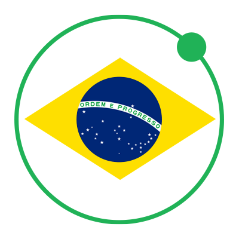

# Guia do Desenvolvedor Ionic
Um ótimo guia para aprender mais sobre Ionic e estar por
dentro das novidades.

Este guia é baseado no repositório [Ionic Adventures](http://github.com/juarezpaf/ionic-adventures) e tem como objetivo ser a fonte principal de informações relacionadas a conteúdo em Português para quem desenvolve utilizando o Ionic SDK e será mantido pela comunidade [Ionic Brazil](http://github.com/ionicbrazil).

## O que é o Ionic SDK?
O Ionic SDK é um projeto Open Source gratuito usado no desenvolvimento de aplicativos híbridos para as plataformas Android 4.4+ e iOS 6+ com suporte parcial ao Windows Phone. Ionic SDK utiliza os recursos do HTML, CSS, Javascript e AngularJS, que possui o objetivo de deixar a experiência do usuário fluída e diminuir o tempo de desenvolvimento, e tem ganho notoriedade também pelo conjunto de ferramentas disponibilizados como Ionic View, Ionic Push, entre outras.

O Ionic também possui integração com o [Cordova](https://cordova.apache.org/) e o [ngCordova](http://ngcordova.com/) tornando capaz a utilização de recursos nativos dos dispositivos.

## Apresentações

* [Aplicativos Híbridos com Ionic. Você também pode começar a desenvolver agora!](http://www.tiagoporto.com/aplicativos-hibridos-com-ionic-voce-tambem-pode-comecar-a-desenvolver-agora) por @tiagoporto
* [Ionic Rocks!](https://speakerdeck.com/vitormalencar/ionic-rocks) por @vitormalencar
* [Construindo Aplicativos Híbridos com Ionic Framework](http://alvarowolfx.github.io/ionic-present/#/) por @alvinhuuu

## Artigos

* :zap: [O que eu preciso saber para começar com Ionic Framework](http://tutsmais.com.br/blog/ionicframework/o-que-eu-preciso-saber-para-comecar-com-ionic-framework) por @felquis
* [Introdução ao Ionic Framework](http://tableless.com.br/introducao-ao-ionic-framework/) por @grillorafael
* [Aplicativos mobile com o AngularJS e Ionic](http://frontinbrazil.com.br/aplicativos-mobile-com-o-angularjs-e-ionic/) por @JLCarv
* [Criando aplicativo com Ionic Framework](http://nicholasess.com.br/desenvolvimento/criando-aplicativo-com-ionic-framework-serie/) por @nicholasess
* [Apps Híbridas com Cordova e Ionic #1](http://luisvasconcellos.com/2015/04/06/apps-hibridas-com-cordova-e-ionic.html) por @vasconcelloslf

## Livros

* [The Ionic Book](http://ionicframework.com/docs/guide/) por @ionicframework
* [Ionic in Action](http://www.manning.com/wilken) por @gnomeontherun 
* [Developing an Ionic Edge](http://bleedingedgepress.com/developing-ionic-edge/) por @keithdmoore94
* [Full Stack Mobile App with Ionic Framework](http://amzn.com/B00QF1H380) por Hoc Phan

## Eventos, Cursos e Workshops

* [MobileConf 2015 - Rio de Janeiro](http://www.mobileconf.com.br/) `28/05/2015 e 29/05/2015` - *Workshop de Phonegap com Ionic* por @Loiane
* [JSday - Feira de Santana](http://www.jsday.com.br/) `05/06/2015` - *Ionic Framework: The excuses are over to start to create amazing apps* por @MatheusCAS
* [FISL - Porto Alegre](http://softwarelivre.org/fisl16) `8 a 11 de Julho de 2015` - *Oficina de Phonegap com Ionic* por @Loiane
* [Workshop Ionic Framework e Firebase em São Paulo](https://kaumac.typeform.com/to/ovUnoW) `pré-cadastro`
* [Front in Fortaleza](http://www.frontinfortaleza.com.br/) - *Ionic Rocks!* por @vitormalencar

## Ferramentas

* [Ionic Creator](https://creator.ionic.io/)
* [Ionic playground](http://play.ionic.io/)
* [Ionic View](http://view.ionic.io/)
* [Ionic Push](https://apps.ionic.io/landing/push) - Em breve

## Open Source

* [Front in Fortaleza App](https://github.com/devevents/front-in-fortaleza-app) por @mabrasil
* [Front Cuiabá App](https://github.com/alvarowolfx/front-in-cuiaba-app) por @alvinhuuu
* [Desafio Meetup Mobile Dev BH](https://github.com/tiagoporto/desafio-mobile) por @tiagoporto

## Showcases no Brasil

* [Mãe guru](http://maeguru.com.br/) por @fluid27
* [Vivo open Air](https://itunes.apple.com/us/app/vivo-open-air/id940039537?mt=8) por @vasconcelloslf
* [uPDV](https://play.google.com/store/apps/details?id=com.ionicframework.updv389492) por @MatheusCAS
* [Peladeiro App](https://play.google.com/store/apps/details?id=com.alexandreoliveira.peladeiroapp) por @alexandreetf
* [Giga Agenda](https://play.google.com/store/apps/details?id=com.tsp.gigaagenda532012)
* [Renda Fixa](http://rendafixa.rocks/)
* [99folks](http://99folks.com) por @crp_underground
* [MobileConf 2015](http://goo.gl/wY5aoO) - Ionic View ID 20482a46 - por @thompsonweb

## Comunidade Ionic Brazil

* [Twitter](http://twitter.com/ionicbrazil)
* [Slack](http://ionicbrazil.herokuapp.com)
