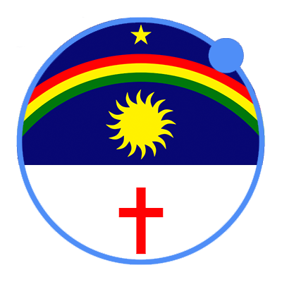
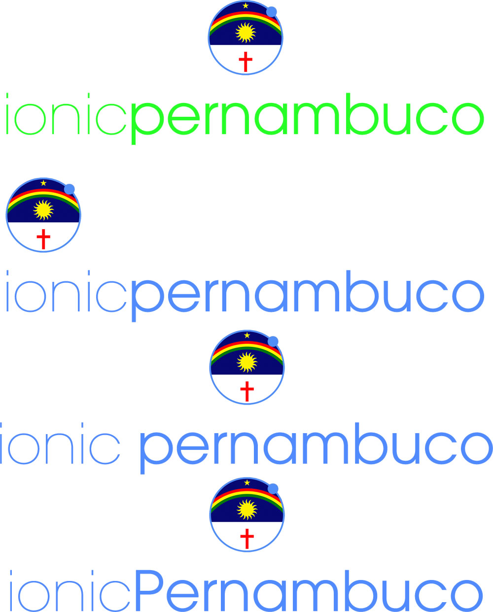

# Logo Style Guide

Este documento tem como finalidade descrever um padrão de ícone e logos para os Meetups e times do Ionic Brazil. Os arquivos devem ser feitos da seguinte forma:

## Ícone

A base do ícone do Meetup é o próprio logo do Ionic (você pode encontrá-la [aqui](https://s3.amazonaws.com/ionicframework.com/logo-pack.zip)). Utilizamos apenas a órbita externa do logo, removendo o núcleo. A parte interna deve ser preenchida com a bandeira do Estado, de maneira sólida, cores originais, com 100% de opacidade. Como alternativa, pode ser utilizado apenas o brasão estadual no lugar do núcleo do átomo do Ionic. Neste caso o brasão deve estar obrigatoriamente alinhado ao centro da figura. O núcleo do átomo não deve aparecer em nenhuma situação.

#### Exemplos

## Logo

O Logo completo se constitui da seguinte forma: todos os elementos centralizados na página, com o ícone (descrito anteriormente) com 350x350 pixels, e a o texto "ionic<meetup>", em 248pt ou , usando a [fonte Avant Garde](https://www.myfonts.com/fonts/itc/avant-garde-gothic/). Sendo "ionic" na variação "Extra Light" e o nome do meetup na variação "Book" da Avant Garde. Há um espaçamento de 82 pixels entre o texto e o ícone.

Sob nenhuma hipótese nenhum caractere do texto no logo deve estar em maíusculo, ou deve haver espaços entre as palavras do logo.

#### Exemplos corretos

Ver figuras com final `-logo.png`, nas sub-pastas já neste repositório. Nenhuma logo fora do padrão será aceita, a não ser que exista um motivo **muito bom** pra isso acontecer.

#### Exemplos incorretos

